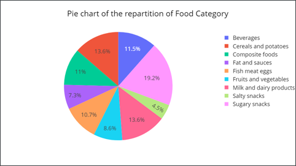
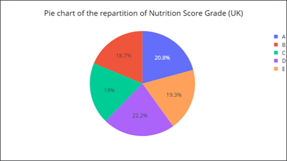
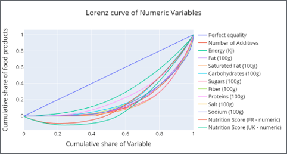
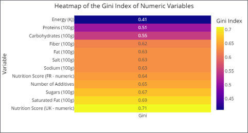
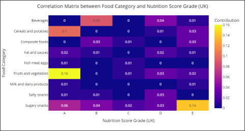
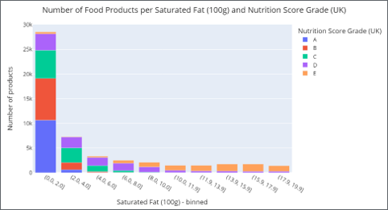

# Analyzing Food Data

During this project, I analyze an open source food dataset available here :

[Open Food Dataset](https://world.openfoodfacts.org/)

I perform univariate, bivariate, multivariate as well as correlation analysis
of the provided variables in order to draw conclusions about global
health trends.

## Useful Links

* [Project presentation (Powerpoint)](Project_Presentation.pptx)
* [Jupyter Notebook](Notebook.ipynb)

## Screenshots

### Data Analysis

## Libraries / Packages Used

* [Scipy](https://scipy.org/)
* [Matplotlib](https://matplotlib.org/)
* [Plotly](https://plotly.com/python/)
* [Seaborn](https://seaborn.pydata.org/)
* [Pandas](https://pandas.pydata.org/)
* [Numpy](https://numpy.org/)

## Developed By

Octave Antoni

[Connect with me on Linkedin](https://www.linkedin.com/in/octave-antoni/)

## License

    Copyright 2023 Octave Antoni

    Licensed under the Apache License, Version 2.0 (the "License");
    you may not use this file except in compliance with the License.
    You may obtain a copy of the License at

        http://www.apache.org/licenses/LICENSE-2.0

    Unless required by applicable law or agreed to in writing, software
    distributed under the License is distributed on an "AS IS" BASIS,
    WITHOUT WARRANTIES OR CONDITIONS OF ANY KIND, either express or implied.
    See the License for the specific language governing permissions and
    limitations under the License.